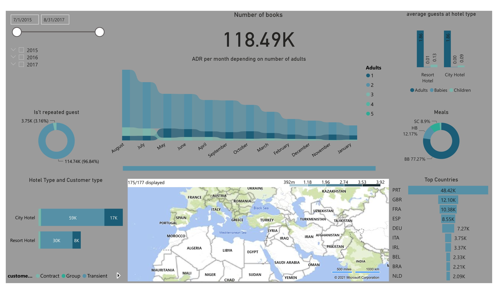

# Predicting The Cancellation Hotel Booking
abdulaziz alkhonain

## Abstract

The goal of this project was to use classification models to predict wither the book is going to be cancelled or not depending on number of features to help the hoteles wither the book is most likly to cancel or not. This data set contains booking information for a city hotel and a resort hotel, and includes information such as when the booking was made, length of stay, the number of adults, children, and/or babies, and the number of available parking spaces, among other things. you can find the [data source here](https://www.kaggle.com/jessemostipak/hotel-booking-demand)

## Project Components

- [Proposal](https://github.com/alkhonain/Tuwaiq_project/blob/main/Proposal/Proposal.md)
- [MVP](https://github.com/alkhonain/Tuwaiq_project/blob/main/mvp/mvp.md)
- [Project](https://github.com/alkhonain/Tuwaiq_project/tree/main/project)

## Data

he dataset contains 119,390 books with 32 features for each, the features were spareted half of them were numerical, most of them are discrete, and the other is categorical. 
Features that may be confused:
* Hotels, there is two type of hotels, Resort Hotel and City Hotel.
* lead_time, Number of days that elapsed between the entering date of the booking into the PMS and the arrival date.
* reservation_status, Reservation last status, assuming one of three categories: Canceled – booking was canceled by the customer - Check-Out.
* adr, Average Daily Rate as defined by dividing the sum of all lodging transactions by the total number of staying nights.
* customer_type, Type of booking, assuming one of four categories: Contract - when the booking has an allotment or other type of contract associated to it; Group – when the booking is associated to a group; Transient – when the booking is not part of a group or contract, and is not associated to other transient booking; Transient-party – when the booking is transient, but is associated to at least other transient booking.
* deposit_type, Indication on if the customer made a deposit to guarantee the booking. This variable can assume three categories: No Deposit – no deposit was made; Non Refund – a deposit was made in the value of the total stay cost; Refundable – a deposit was made with a value under the total cost of stay.
* previous_cancellations and previous_bookings_not_canceled, which are number representing the previous cancellations/bookings not canceled by the customer.

you can find the [Dataset here](https://github.com/alkhonain/Tuwaiq_project/blob/main/project/project_dataset.csv)

## Algorithms

In the project I used nine models and select the best model of them, and before applying the model I have do some EDA that can be found in the notebook to figure out how to improve the result and from that I have done the preprocessing that also founded in the notebook which create some features from other to found the grate solution from simple model and the result I got in quite impressive, the following is the result I got from classification report:

| ------------- |
|              ||precision|    |recall|  |f1-score|   |support|
| ------------- | ------------- | ------------- | ------------- | ------------- |
|          ||0|       |0.93|      |0.98|      |0.95|     |14829|
           |1 |      |0.96|      0.88|      |0.92|      |8869|
   |accuracy|           ||           ||     |0.94|    |23698|
    |macro avg |    |0.95|      |0.93 |     |0.94|    |23698|
    |weighted avg|   |0.94|      |0.94  |    |0.94|     |23698|
---

## Tools

- Numpy and Pandas for data manipulation
- Scikit-learn for modeling
- Matplotlib, Seaborn and Plotly for plotting
- Power BI for interactive visualizations

## Communication

In addition to the slides and visuals presented, [Dashboard](https://app.powerbi.com/links/J0U_XkHnTo?ctid=f2e06d3e-47a5-424e-84d5-7818cd99b0fa&pbi_source=linkShare) that present the dataset interactively 

