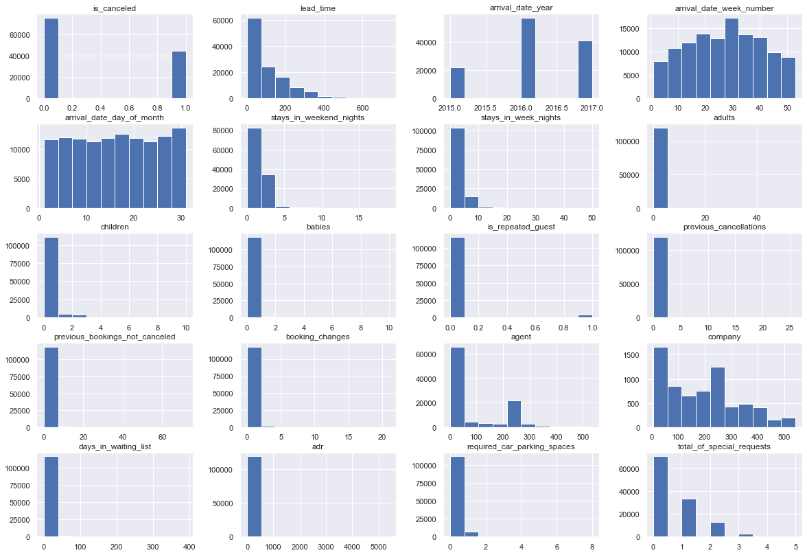
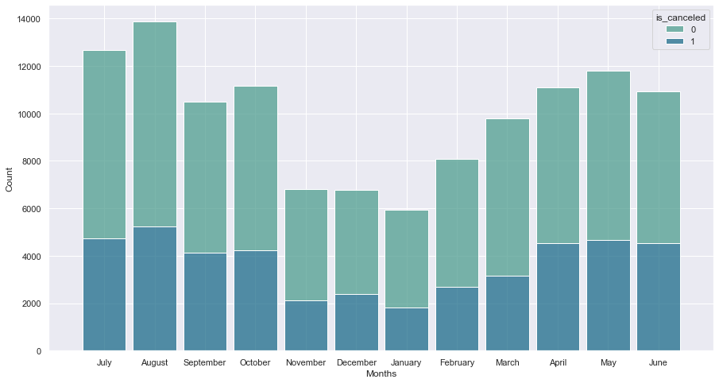

# Project MVP

the process of the project is in the selecting the best model which will try almost every possible solution and then select the best score and apply it.
i have done the cleaning part and you can check that by visiting it [here](https://github.com/alkhonain/Tuwaiq_project_one/blob/main/project/project.ipynb)

## Exploratory Data Analysis
  
  Exploring the data was challenging and got pretty nice results, and starting with knowing the type of each feature and what entry i expect by applying
  ```python
df.hist(figsize=(20,14))
```



  and then want to see how is months are affecting the cancelation by creating the below graph, which tells us what we need. but, i notice that there are no correlation of that.
  
  
  after spending time with manipulate with the data i kind of some missing data and outliers that could affect the results and from that i will handel them in the preproccing part.
